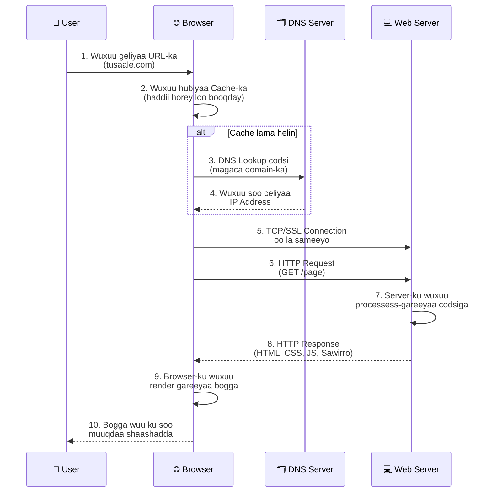
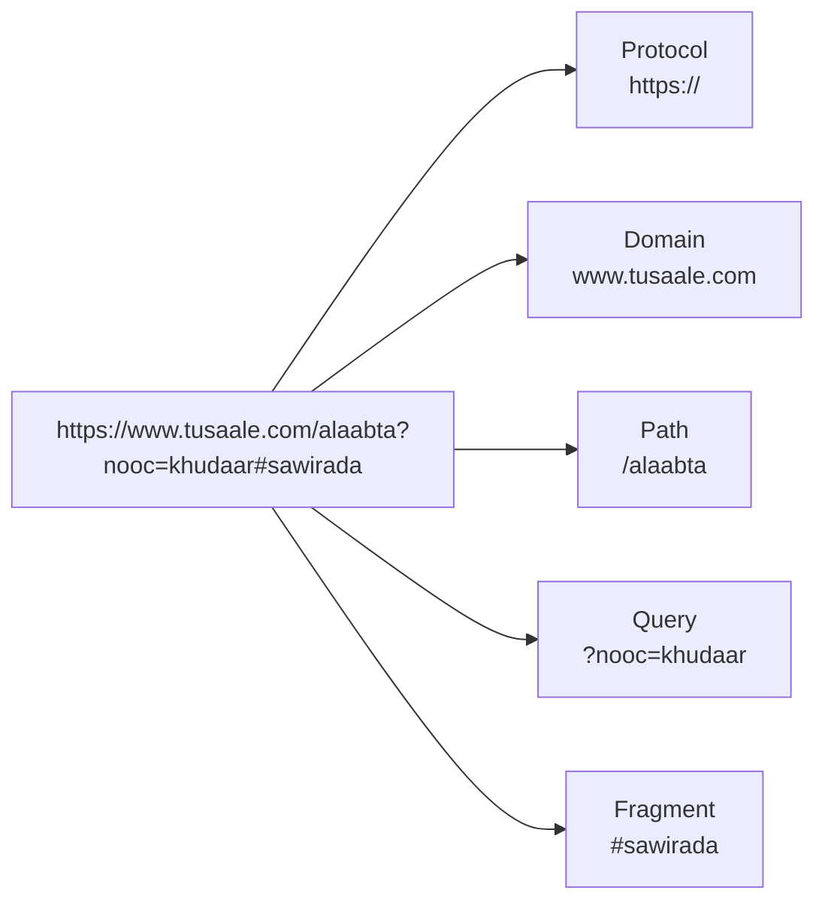

# Socodka URL-ka - Diagram

## Sida URL-ku uga gudbo Browser-ka ilaa Bogga la Arko

## Qaybaha URL-ka (URL Breakdown)

## Sharaxaad Kooban

| Tallaabo | Qeybta | Shaqada |
|---|---|---|
| 1 | User | Wuxuu geliyaa URL-ka browser-ka |
| 2 | Browser | Wuxuu hubiyaa cache-ka |
| 3-4 | DNS Server | Domain-ka wuxuu u beddelaa IP address |
| 5 | Browser + Server | Xiriir ayaa la sameeyaa (TCP/TLS) |
| 6 | Browser | Wuxuu diraa HTTP Request |
| 7 | Web Server | Wuxuu processess-gareeyaa codsiga |
| 8 | Web Server | Wuxuu soo celiyaa HTTP Response |
| 9-10 | Browser | Wuxuu render gareeyaa oo bogga soo bandhigaa |